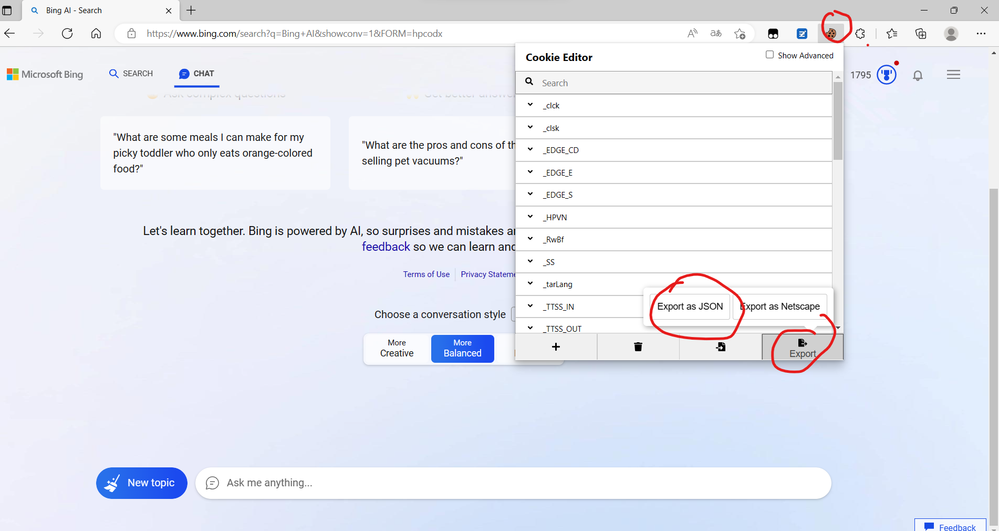

# Bing_api
unofficial api for new bing
newbing的非官方接口

This repository is based on [EdgeGPT](https://github.com/acheong08/EdgeGPT)

将newbing接入命令行能大大提高newbing的可玩性。
动手能力强的建议直接修改原仓库，省事点可以直接参照demo.py改出自己的模板
本仓库的代码的EdgeGPT.py稍微修改过一点，和原仓库的有些许不同


# prepare
- 1.需要通过waitlist
- 2.有魔法
- 3.安装[Cookie-Editor](https://microsoftedge.microsoft.com/addons/detail/cookieeditor/neaplmfkghagebokkhpjpoebhdledlfi)
- 4.获取你的cookie并将其粘贴到cookies.json 中

# How to run
```python
conda create -n bing python=3.9
conda activate bing
pip install -r req.txt

# 需要重复使用某个prompt时，可参照demo.py 设计自己的模板
# 查看demo.py

# 连续对话模式
python EdgeGPT.py


```

# addition
[一些有意思的prompt](https://github.com/f/awesome-chatgpt-prompts)
api还能和其他模型进行组合，可以自行探索
